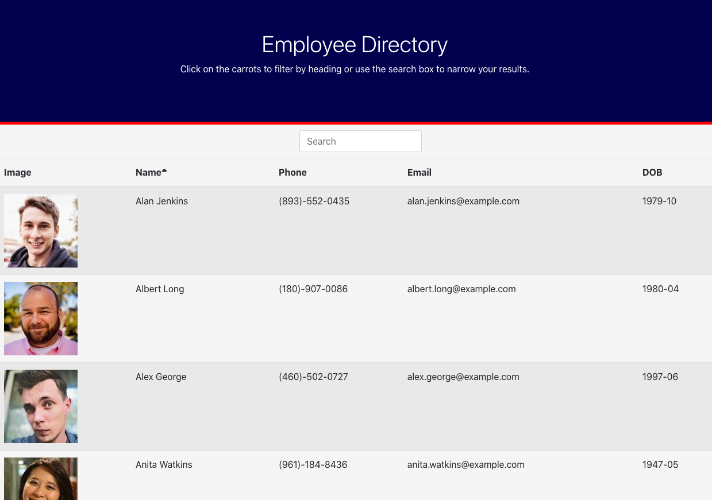

# albusterEmployeeDirectory
The What!
Hello all! This applicaiton will help companies filter throught their millions of employees! It has a simple search bar that will comb through the employees by first name, last name, phone number and even email. There also is an option to sort all employees descending by first name.

The How?
This applicaiton uses entirley React.js. It has two components, a header and a table. The javascript is written to respone to user input in real time. All of the data is currently being pulled from an axios call to a random userAPI network.

The Why?
Showcase React.js functionality.

The Where?
Try the app out here! https://johnsondavid1107.github.io/albusterEmployeeDirectory/

The Who
This applicaiton is maintained by myself. I can be reached for contributions, or questions here:

johnsondavid1107@gmail.com
